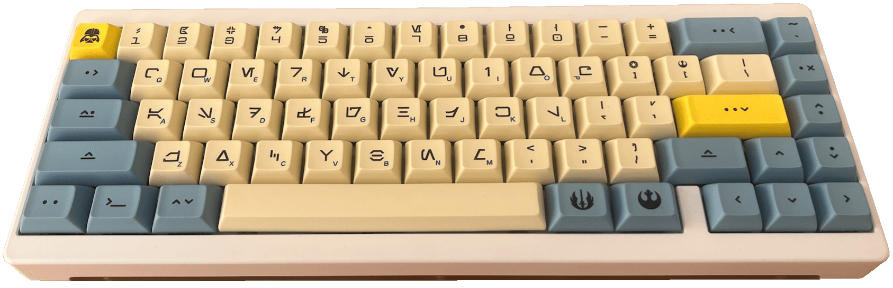

# Aurebesh Font

A Star Wars fan font.

> In a galaxy far, far away // no wait, it was right here on earth!

I had just bought a Aurebesh keycap set for a keyboard of mine, and wanted to install a font ... alas ... not as simple as I thought.

Finding the right usable font turned out to be troublesome.

- This [**Wookieepedia** article](https://starwars.fandom.com/wiki/Aurebesh) seems to be the definitive definition of the Aurebesh character set.
    - But it's missing a whole bunch of font-able characters needed for a font, most notably the numerals *(0-9)*, some of the mathematical operators *("+", "=", etc.)*, and some of the other often used characters *("~", "{", "[", "@", and so on)*.
- The keycaps seem to have been made based on the Neale Davidson's *(from [pixelsagas.com](https://pixelsagas.com))* **Aurebesh** font.
    - But that font has the capital letters turned around! ***(?)***
    - This to me was nonsensical, as the definition of Aurebesh does not support that assumption.
    - However it is the most widely used Aurebesh font *(an assumption I'm making based on how many sites have it for download!)*
    - Other variants, like **Aurebesh Cantina**, have also adopted this horizontal inversion for capitals.
    - And yet others, like **AurekBesh Hand**, have not *(alas, that font also uses another discrepancy, in that the numerals being dot-count based, and not the more common western numerals used in the fore-mentioned fonts)*.
- The closest to true representation of the **Aurebesh** font was made by Yari Leferink, *(from [aurebesh.org](https://aurebesh.org))*
    - His work was the closest to "true" I could find, i.e.:
        - Capitals are same size and orientation as lower case characters
        - Support for Ligatures
    - But I wanted a font that was closer to some of the characters on my keyboard.

## This work

So I set out to create my own.

Stephen Crane's original definition of the Aurebesh writing system is known as:

> Sourced from the Wookieepedia article forementioned.

My approach on this was to render S. Crane's definitions verbatim as SVG's and port them into the font. Thus creating yet another version of the Aurebesh font, built with [BirdFont](https://birdfont.org/) and released under the [SIL Open Font License (OFL-1.1)](LICENSE.md).

Get the font file from [dist/Aurebesh.ttf](https://github.com/vinorodrigues/font-aurebesh/raw/main/dist/Aurebesh.ttf)

See it in action with the test website, located at [vinorodrigues.github.io/font-aurebesh](https://vinorodrigues.github.io/font-aurebesh/)

## Features:
* Correct canon uppercase characters.  Uppercase characters are however 10% larger - just subtle enough to be visible as a capital.
* Numerals are represented as western numerals-like characters.
* Ligatures sporting extended legends for "ch", "ae", "eo", "kh", "ng", "oo", "sh" and "th". *(...and "Ch", "Ae", "Eo", "Kh", "Ng", "Oo", "Sh" and "Th", but not "CH" etc. as it's assumed double uppercase represents an initialism.)*

## I need help

I'm no font expert ... so if you have some knowledge to share or recommendations; please feel free to do so via the [**Issues**](https://github.com/vinorodrigues/font-aurebesh/issues) tab.  This includes:
* Spacing and Kerning recommendations
* Requests for additional characters

------------------------------------
<small>This project would not have been possible without the influence of [Andy Price](https://www.instagram.com/Andylah42542/) of the [Southern Cross Garrison / 501st Legion](https://www.501scg.org/).</small>

&#8212; made with &#9825;, Vino Rodrigues
